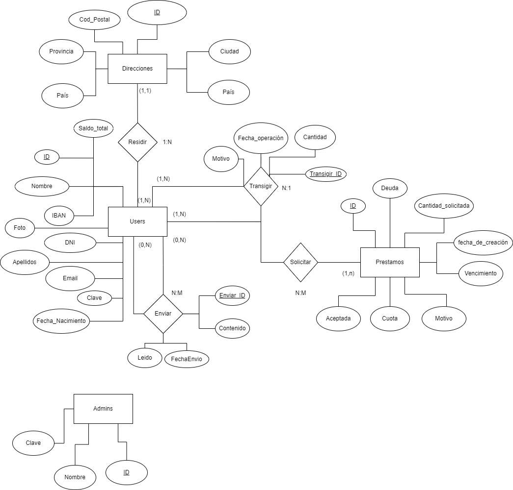
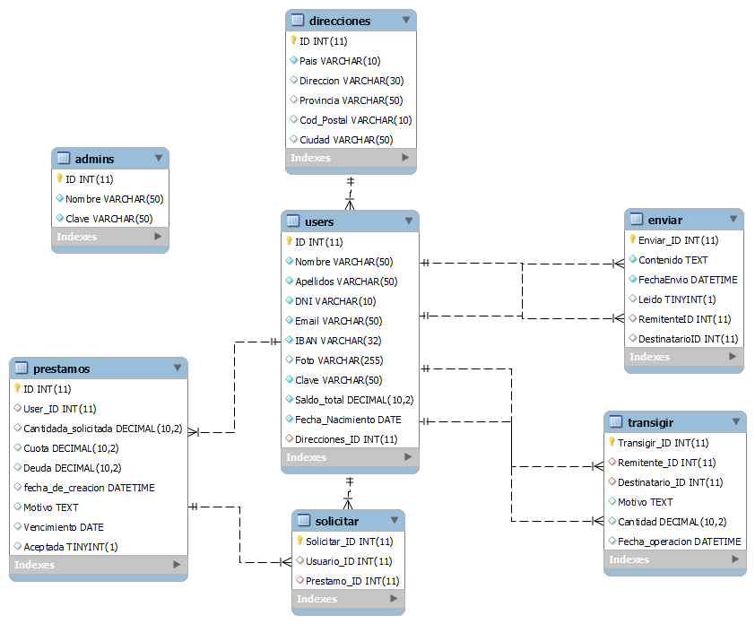

# Índice

1. [Lenguaje de Marcas](#lenguaje-de-marcas)
    - [Uso de Variables](#uso-de-6-variables)
    - [Uso de Selectores](#uso-de-6-selectores)
    - [Uso de Operaciones](#uso-de-4-operaciones)
    - [Uso de Funciones y Bucles](#uso-de-4-funciones-y-4-bucles)
    - [Uso de Mixins](#uso-de-6-mixins)
    - [Includes y otros](#uso-de-2-includes-y-otras-funciones)

2. [Entorno Servidor](#entorno-servidor)
    - [Modelo Entidad-Relación](#modelo-entidad-relación)
    - [Modelo Relacional](#modelo-relacional)
    - [Normalización](#normalización)
    - [Herramientas Utilizadas](#herramientas-utilizadas)
## Lenguaje de Marcas

### Uso de 6 variables:
[scss con variables principales](css/_var.scss)

```
$palette-Light-Blue: #77A3E0;
$palette-Blue: #3457C8;
$palette-Yellow: #7c5c07;//#E6B637
$palette-White: #EBF0F2;
$palette-Black: #000454;
$font-path1: '../resources/fonts/Roboto/Roboto-Bold.ttf';
```

### Uso de 6 selectores
 [anidamientos y selectores](css/_header.scss)
### Uso de 4 operaciones
 [operaciones calc](css/_var.scss)

```
$icon-sm-md-bottom:calc(#{$navbar-icon-size-bottom} * 1.3vw);
$icon-sm-md-top:calc(#{$navbar-icon-size-top} * 1.3vw);
$icon-xl-top:calc(#{$navbar-icon-size-xl-top} * 1.3vw);
margin-bottom: calc(9vh + 1.6rem); (_msgs.scss)
```

### Uso de 4 funciones y 4 bucles
 [Bucles y funciones](css/_bucles_y_func.scss)

```
// aplicamos esa fuente a todos los h
@for $i from 1 through 6 {
  h#{$i} {
    font-family: $font-family-Roboto;
  }
}
```

```
// a este "array" de elementos le aplicamos otra fuente distinta
$elementos-texto: "button", "input", "textarea", "select", "p";

@each $elemento in $elementos-texto {
  #{$elemento} {
    font-family: $font-family-Muesli;
  }
}
```

```
// font weight personalizada para los <p> que esten dentro de <a>
@function aplicar-font-weight($valor) {
  $font-weight: $valor * 100;
  @return $font-weight;
}

@mixin aplicar-estilos-enlaces-con-p($font-weight) {
  a {
    p {
      font-weight: aplicar-font-weight($font-weight);
    }
  }
}
// 700 = bold
@include aplicar-estilos-enlaces-con-p(7);
```

```
// cambiar color texto de los enlaces y svg al hacer hover oscurecemos el color de antes
@mixin aplicar-color-enlaces-svg($color) {
  a {
    color: $color;

    &:hover {
      color: oscurecer($color, 10%);
      svg {
        fill: oscurecer($color, 10%);
      }
    }

    svg {
      fill: $color;
    }
  }
}
// oscurecemos un 10% el color que tenemos antes del hover
@function oscurecer($color, $porcentaje) {
  @return darken($color, $porcentaje);
}

@include aplicar-color-enlaces-svg($palette-Yellow);
```

```
// apartir de la columna 7 al hacer hover tiene un color, antes otro
@function calcular-color($columna-hover, $umbral) {
  @if $columna-hover < $umbral {
    @return #d5afaf; // Cambiar a color 1 si el número de columna es menor que el umbral
  } @else {
    @return #72878e; // Cambiar a color 2 si el número de columna es mayor o igual al umbral
  }
}

$umbral-columnas: 7;

$numero-de-columnas: 12;

@for $i from 1 through $numero-de-columnas {
  table tbody tr td:nth-child(#{$i}):hover {
    background-color: calcular-color($i, $umbral-columnas);
  }
}
```

```
// cambiamos el color del borde y el tamaño segun la posicion
@function calcular-color-borde($columna) {
  @if $columna % 2 == 0 {
    @return $palette-Black;
  } @else {
    @return $palette-White;
  }
}

$numero-de-columnas: 12;

@for $i from 1 through $numero-de-columnas {
  table tbody tr td:nth-child(#{$i}):hover {
    border: 2px solid calcular-color-borde($i);
  }
}
```

### Uso de 6 mixins
 [mixins](css/_mixins.scss)

```
// evitamos ciertos margenes de boostrap
@mixin antibootstrap{
  margin:0 10px 0 0  !important;
  padding: 0px !important;
}
```

```
// quitamos margenes de boostrap
@mixin antibootstrap-h1{
  margin: 0px !important;
  padding: 0px !important;
}
```

```
// centrar elementos en columnas
@mixin flex-column-align-justify{
  display: flex;
  flex-direction: column;
  align-items: center;
  justify-content: center;
}
```

```
// centrar elementos personaliazdo, por defecto row
@mixin flex-align-justify($direction: row, $justify-content: center, $align-items: center) {
  display: flex;
  flex-direction: $direction;
  justify-content: $justify-content;
  align-items: $align-items;
}
```

```
// tamaño de iconos top header personalizable
@mixin icono-estilos($icon-size: $navbar-icon-size-top, $factor-de-tamano: 1.3vw, $max-height: 8vh, $margin-inferior: 5px) {
  width: calc(#{$icon-size} * #{$factor-de-tamano});
  max-height: $max-height;
  margin: $margin-inferior 0;
}
```

```
// tamaño svg billete user_view
@mixin saldo_icon {
  display: none;
  width: calc(#{$icon-xl-top} + 10vw);
  min-width: 15vw;
  max-width: 10vw;
  max-height: 10vh;
}
```

### Uso de 2 includes y otras funciones
(todo el proyecto)
```
@include flex-align-justify;
@include antibootstrap-h1;
@use 'saldo';
@import "var";
@return darken($color, $porcentaje);
```

## Entorno Servidor

### Modelo Entidad-Relación



### Modelo Relacional



### Normalización

he normalizado la tabla hasta el nivel 3NF excepto casos especificos de la tabla usuario que implicarian crear tablas con valores unicos o la tabla admin,que no intercambia datos con ninguna tabla

### Herramientas utilizadas

Draw.io: para la creación del modelo Entidad-Relación.
MySql workbench: para la creación de la base de datos.
ChatGpt: para facilitar la busqueda de información y aumentar la eficiencia Ej.LAST_INSERT_ID(); utilizada en la tabla direcciones entre otras.
VsCode: Editor de código por excelencia.
Git y Github: Para el control de versiones del proyecto.

## Entorno Cliente

## otros

disposición de carpetas:

# sesiones (Doc)

1. Global
   1. $\_SESSION["id"]= id user/admin
2. User
   1. $\_SESSION["usuario"] = nombre de user (login)
   2. $\_SESSION["clave"] = clave user (login)
   3. $\_SESSION["accesoUser"]=false; acceso Users
   4. $\_SESSION['Apellidos'] = ape user (login)
   5. $\_SESSION['DNI'] = dni user (login)
   6. $\_SESSION['Email'] = email user (login)
   7. $\_SESSION['IBAN'] = iban user (login)
   8. $\_SESSION['Foto'] = dirección a foto user (login)
   9. $\_SESSION['Saldo_total'] = saldo user (login)
   10. $\_SESSION['Fecha_Nacimiento'] = fecha nacimiento user (login)
   11. $\_SESSION['Direcciones_ID'] = id de la tabla de direcciones asociada (login)
3. Admin
   1. $\_SESSION["accesoAdmin"]=false; acceso admins
